 

<h3><code>$ whoami --verbose</code></h3>

<table>
  <tr>
    <td valign="top" width="40%">
      
    </td>
    <td valign="top" width="60%">
      
    </td>
  </tr>
</table>

 

<h3><code>$ open featured_projects/</code></h3>

<table>
  <tr>
    <td width="50%">
      <h4><a href="https://github.com/TUshARKatpara/movie-rating-analysis">Movie Rating Analysis</a></h4>
      
Cleaned movie metadata, built a short reproducible ML pipeline, and evaluated rating predictions with MAE, RMSE, and R2.

    </td>
    <td width="50%">
      <h4><a href="https://github.com/TUshARKatpara/dA-HR-ANALYTICS-PROJECT">HR Analytics Project</a></h4>
      
Data analytics project focused on HR insights, business storytelling, and practical visualization workflows.

    </td>
  </tr>
  <tr>
    <td width="50%">
      <h4><a href="https://github.com/TUshARKatpara/ds-lab">DS Lab / Jarvis Assistant</a></h4>
      
Python voice assistant project with speech recognition, text-to-speech, Wikipedia search, email setup, and project documentation.

    </td>
    <td width="50%">
      <h4><a href="https://github.com/TUshARKatpara/projects">Projects</a></h4>
      
A growing space for experiments, learning work, and portfolio-ready builds as I sharpen my data science stack.

    </td>
  </tr>
  <tr>
    <td width="50%">
      <h4><a href="https://github.com/TUshARKatpara/TUshARKatpara">GitHub Profile System</a></h4>
      
This profile README itself: animated SVG terminal visuals, contribution graph, and an automated refresh workflow.

    </td>
    <td width="50%">
      <h4><a href="https://github.com/TUshARKatpara/desktop-tutorial">Desktop Tutorial</a></h4>
      
GitHub Desktop practice repository for learning commits, branches, and the basic contribution workflow.

    </td>
  </tr>
</table>

 

<h3><code>$ skills --stack</code></h3>

  <code>Python</code>
  <code>Pandas</code>
  <code>NumPy</code>
  <code>scikit-learn</code>
  <code>SQL</code>
  <code>Matplotlib</code>
  <code>Seaborn</code>
  <code>Jupyter</code>
  <code>Machine Learning</code>
  <code>EDA</code>
  <code>Git</code>
  <code>GitHub</code>

 

<h3><code>$ mission</code></h3>

  I am <strong>Tushar Katpara</strong>, a data science student and aspiring machine learning engineer.
  I build practical projects that turn raw data into clean analysis, useful models, and clear portfolio stories.

  <a href="mailto:tushar.katpara09@gmail.com">Email</a>
  |
  <a href="https://github.com/TUshARKatpara?tab=repositories">Repositories</a>
  |
  <a href="https://github.com/TUshARKatpara">GitHub Profile</a>

